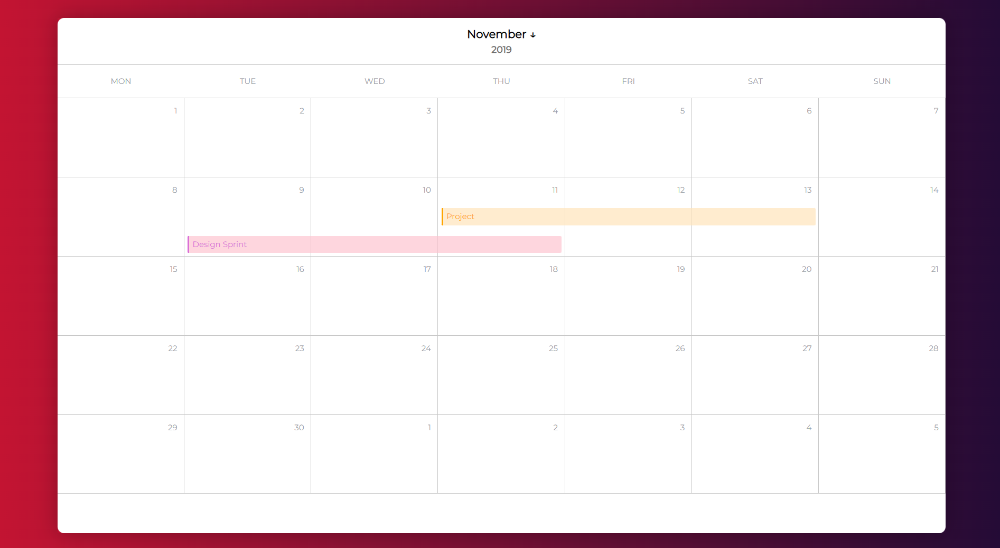

# Calendar Page

Calendar template I found on Dribbble that I used to apply CSS Grid concepts and some advanced CSS selectors.

## Tech Stack

HTML and SASS.

## Live Demo

www.tobeworked.com

#### Showcase

## Installation

Simply clone the repo and run the html file on the browser. If you wish to make any changes to the scss file, install a SASS compiler on the code editor of your preference.

## Support

For support, please email pedroenriquedev@gmail.com.
